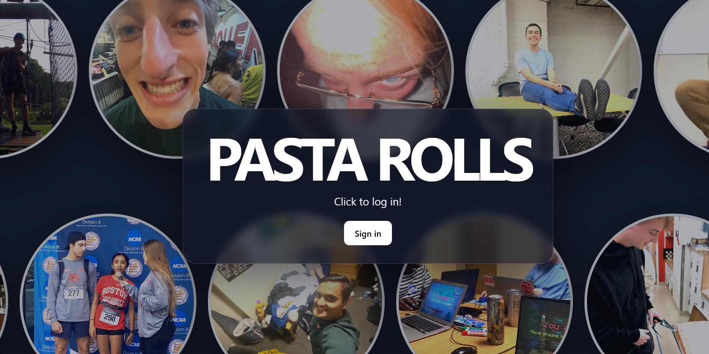
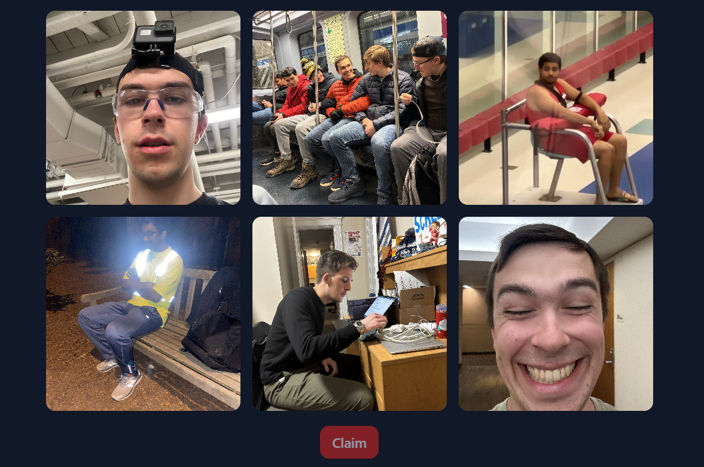
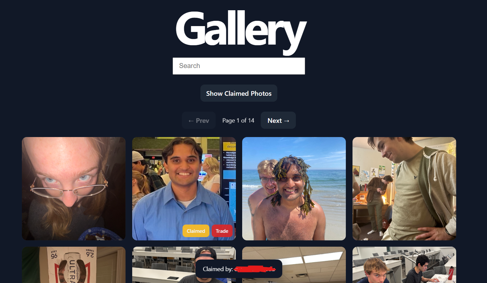
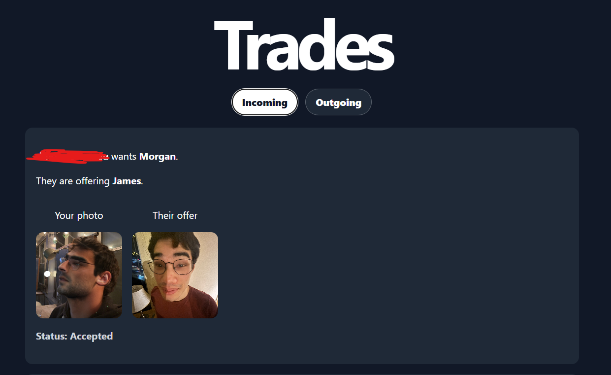

# Pasta Rolls

Pasta Rolls is a web app for collecting, claiming, browsing, and trading photo cards. Users sign in with Google, roll a set of available photos, claim one photo during a claim window, view their personal collection, browse the full gallery, and send or respond to trade requests.

## Live Site

https://pasta-rolls.vercel.app

## Features

- Google sign-in using Passport and Google OAuth
- Roll six available photos at a time
- Claim one photo during each three-hour claim window
- Limit each user to a maximum of 20 claimed photos
- View your claimed photo collection
- Drop/unclaim photos from your collection
- Browse the full gallery of photos
- Search the gallery by photo/person name
- Filter the gallery to show claimed photos
- See who has claimed each photo
- Request trades with other users
- Accept, reject, or withdraw trade requests

## Tech Stack

### Frontend

- React
- TypeScript
- Vite
- Styled Components
- React Router DOM

### Backend

- Node.js
- Express
- Passport.js
- Google OAuth 2.0
- PostgreSQL
- Express Session
- CORS
- dotenv

## Project Structure

```text
Rolls/
├── public/                 # Static photo assets
├── src/                    # React frontend
│   ├── components/         # App views and UI components
│   │   ├── Claims.tsx
│   │   ├── Gallery.tsx
│   │   ├── Rolls.tsx
│   │   ├── Rules.tsx
│   │   ├── Scrolling.tsx
│   │   └── Trades.tsx
│   ├── data/
│   │   └── photoNames.ts   # Photo filename-to-name mapping
│   ├── App.tsx
│   └── main.tsx
├── server/                 # Express backend
│   ├── auth.js             # Google OAuth setup
│   ├── authMiddleware.js   # Protected route middleware
│   ├── db.js               # PostgreSQL connection and schema init
│   ├── schema.sql          # Database tables and indexes
│   └── server.js           # API routes
├── package.json            # Frontend scripts and dependencies
└── vite.config.ts
```

## How to Use the Website

1. Visit the live site at https://pasta-rolls.vercel.app.
2. Sign in with your Google account.
3. Open the Rolls page to roll a set of available photos.
4. Choose one photo from your roll to claim.
5. View your claimed photos on the Claims page.
6. Browse all photos on the Gallery page.
7. Use the Gallery to search for specific people/photos or see which photos have already been claimed.
8. If another user has a photo you want, you can send a trade request.
9. Review incoming and outgoing trade requests on the Trades page.
10. Accept, reject, or withdraw trade requests as needed.

## Screenshots

### Home Page

Login page for the website



### Rolling Photos

Users can roll a set of available photos and choose one to claim.



### Gallery

The gallery lets users browse photos, search by name, and see which photos have already been claimed.



### Trades

Users can send, accept, reject, or withdraw trade requests.

